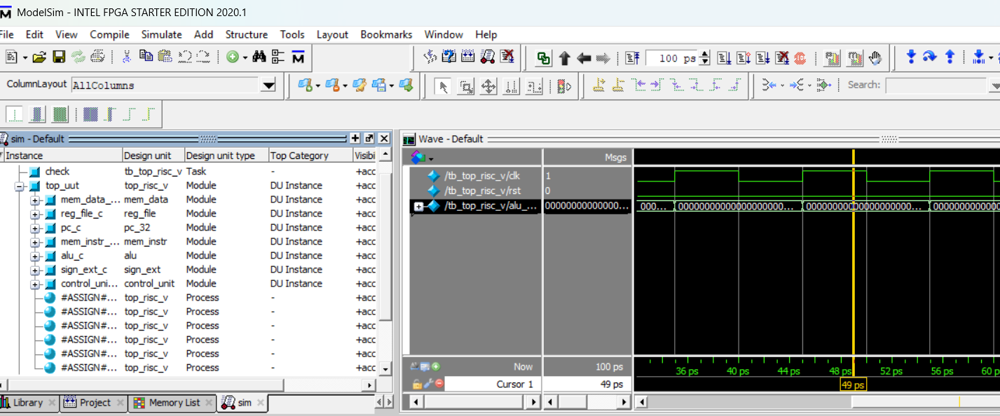
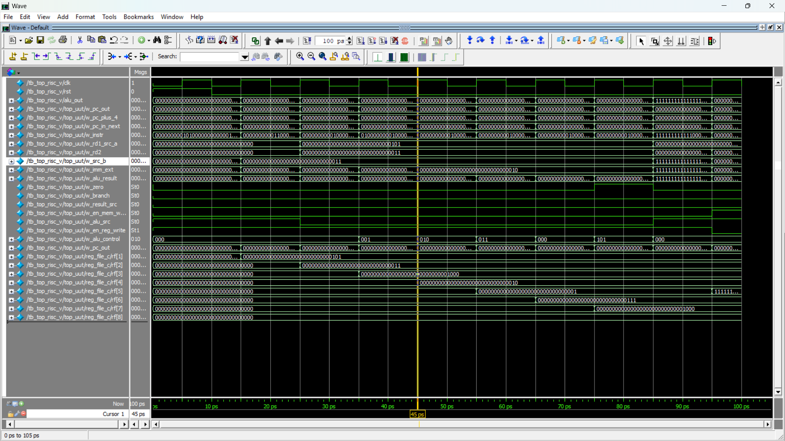
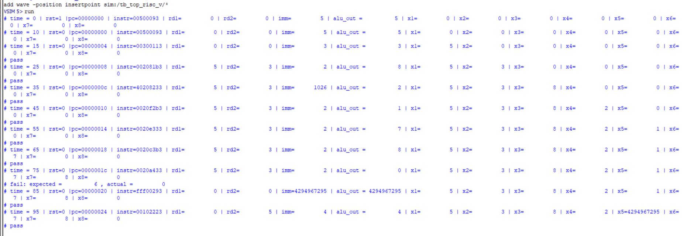
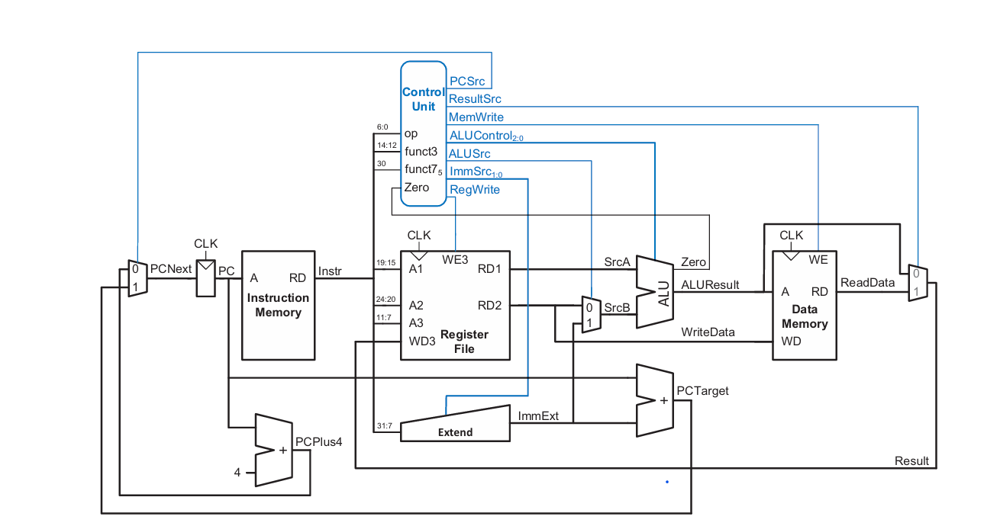

# 🖥️ Simple RISC-V Processor

A simple **single-cycle RISC-V processor** implemented using **Verilog HDL** and verified through simulation using **ModelSim**.

---

## 📌 Project Overview

This project implements a basic RISC-V processor based on the **RV32I instruction format**.

The processor is designed as a simple single-cycle datapath and contains the main components required to fetch, decode, execute, access memory, and write results back to the register file.

The project also includes a Verilog testbench used to verify the processor operation through multiple instruction tests.

---

## 🏗️ Processor Architecture

The processor consists of the following main modules:

| Module | Description |
|---|---|
| `top_risc_v` | Top-level module connecting all processor components |
| `pc_32` | Program Counter |
| `mem_instr` | Instruction Memory |
| `reg_file` | Register File |
| `alu` | Arithmetic Logic Unit |
| `sign_ext` | Immediate Sign Extension Unit |
| `control_unit` | Main Control Unit and ALU Control |
| `mem_data` | Data Memory |

### Main Datapath

```text
              ┌─────────────────┐
              │ Program Counter │
              └────────┬────────┘
                       │
                       ▼
              ┌─────────────────┐
              │ Instruction     │
              │ Memory          │
              └────────┬────────┘
                       │
                       ▼
              ┌─────────────────┐
              │ Control Unit    │
              └────────┬────────┘
                       │
          ┌────────────┴────────────┐
          │                         │
          ▼                         ▼
   ┌──────────────┐         ┌──────────────┐
   │ Register File│         │ Sign Extend  │
   └──────┬───────┘         └──────┬───────┘
          │                         │
          └────────────┬────────────┘
                       ▼
                  ┌─────────┐
                  │   ALU   │
                  └────┬────┘
                       │
              ┌────────┴────────┐
              │                 │
              ▼                 ▼
       ┌────────────┐     ┌────────────┐
       │ Data Memory│     │ Write Back │
       └────────────┘     └────────────┘
```

---

## ⚙️ Supported Instructions

The current implementation was tested using the following instructions:

### Immediate Instructions

- `ADDI`

### R-Type Instructions

- `ADD`
- `SUB`
- `AND`
- `OR`
- `XOR`
- `SLT`

### Memory Instructions

- `LW`
- `SW`

### Branch

- `BEQ` control logic is included in the processor.

---

## 🧩 ALU Operations

The ALU supports the following operations:

| ALU Control | Operation |
|---|---|
| `000` | ADD |
| `001` | SUB |
| `010` | AND |
| `011` | OR |
| `100` | XOR |
| `101` | SLT |

The ALU also generates a `zero` signal used by the branch decision logic.

---

## 🗂️ Project Structure

```text
RISC-V-Processor/
│
├── rtl/
│   ├── top_risc_v.v
│   ├── pc_32.v
│   ├── mem_instr.v
│   ├── reg_file.v
│   ├── mem_data.v
│   ├── alu.v
│   ├── sign_ext.v
│   └── control_unit.v
│
├── tb/
│   └── tb_top_risc_v.v
│
├── RISC-V_Verification_Documentation.pdf
│    
│
├── screenshots/
│   ├── screenshots/blockdigram.png
│   └── screenshots/transcript.png
│   └── screenshots/waveform_full.png
│   └── screenshots/waveform_transcript.png
└── README.md
```

---

## 🧪 Verification

A dedicated Verilog testbench was developed to verify the processor.

The testbench:

- Generates the clock signal.
- Applies reset to the processor.
- Runs the instruction sequence stored in instruction memory.
- Monitors the processor internal signals.
- Checks expected register values.
- Reports `PASS` or `FAIL` for individual tests.

### Example Verification Sequence

The instruction memory contains a sequence including:

```text
ADDI x1, x0, 5
ADDI x2, x0, 3

ADD  x3, x1, x2
SUB  x4, x1, x2
AND  x5, x1, x2
OR   x6, x1, x2
XOR  x7, x1, x2
SLT  x8, x1, x2

ADDI x5, x0, -1

SW   x1, 4(x0)
LW   x6, 4(x0)
```

Expected results include:

```text
x1 = 5
x2 = 3
x3 = 8
x4 = 2
x5 = 1
x6 = 7
x7 = 6
x8 = 0
```

---

## 📊 Simulation Results

The processor was simulated using **ModelSim**.

### Waveform

The waveform was used to observe the internal processor signals, including:

- Clock and reset
- Program Counter
- Instruction
- Control signals
- Register File outputs
- Immediate value
- ALU inputs
- ALU result
- Zero flag
- Data memory signals


.
.
.

### Simulation Transcript

The simulation transcript shows the processor state at different simulation times and displays the verification results.


---

## 🔍 Internal Signals Monitored

The following internal signals were monitored during simulation:

```text
w_pc_out
w_pc_plus_4
w_pc_in_next
w_instr

w_rd1_src_a
w_rd2
w_src_b
w_imm_ext

w_alu_result
w_zero

w_branch
w_result_src
w_en_mem_write
w_alu_src
w_en_reg_write
w_alu_control
```

Register values were also monitored:

```text
x1
x2
x3
x4
x5
x6
x7
x8
```

---

## 🛠️ Tools Used

- **Verilog HDL**
- **ModelSim**
- **GitHub**

---

## 📚 Documentation

A detailed project report is available here:

📄 [RISC-V Verification Documentation](RISC-V_Verification_Documentation.pdf)

The documentation includes:

- Processor architecture
- Module descriptions
- Testbench
- Verification methodology
- Simulation results
- Waveform analysis
- Detected issues and verification results

---

## 🎯 Project Objectives

The main objectives of this project are:

1. Implement a basic RISC-V processor using Verilog HDL.
2. Connect the processor datapath and control unit.
3. Implement basic arithmetic and logical operations.
4. Implement load and store memory operations.
5. Develop a verification testbench.
6. Monitor internal processor signals using simulation waveforms.
7. Verify the correctness of processor operations using expected results.

---

## 👨‍💻 Author

**Ahmed Elbendary Ramadan Elbendary**

RISC-V Processor Design & Verification Project 
